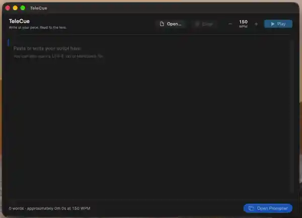

<p align="center">
  
</p>

<h1 align="center">TeleCue</h1>

TeleCue is a small native desktop teleprompter for recording videos, podcasts, presentations, tutorials, and webcam content. 
It turns a local text or Markdown script into a smooth, words-per-minute-paced floating prompt—no account, cloud service,
analytics, or database required.

## Demo



[View the original MP4](docs/assets/telecue-recording.mp4)

## Installation

### Homebrew

```bash
brew install --cask repasscloud/tap/telecue
```

### GitHub Releases

Pre-built releases are also available from the repository's **Releases** page. Download the latest release for your platform from `releases/latest`.

## Platform status

| Platform | Status | Native stack |
| --- | --- | --- |
| macOS 14 or later | MVP implemented | Swift, SwiftUI, AppKit |
| iOS and iPadOS 17 or later | Prototype ([details](src/ios/README.md)) | Swift, SwiftUI, UIKit |
| Windows | Planned | C#, .NET, WinUI 3 |
| Linux | Planned | Rust, GTK4 |

The macOS app is the active implementation. Windows and Linux intentionally contain planning notes rather than non-functional placeholder applications.

## What works on macOS

- Paste and edit a script, or open UTF-8 `.txt`, `.md`, and `.markdown` files.
- See live word count and estimated reading time at the selected pace.
- Pace the prompt from 80–250 WPM in 5 WPM steps.
- Play, pause, restart, and manually reposition without playback jumps.
- Resize a native always-on-top floating window and restore its last position.
- Adjust text size, reading-focus position, and focus visibility.
- Mirror the prompt horizontally for physical teleprompter glass.
- Switch to a borderless presentation window.
- Restore WPM, font size, line spacing, focus, mirror, presentation style, and prompter window placement between launches.

## Screenshots

Screenshots will be added with the first packaged release.

## Requirements

- macOS 14 Sonoma or later
- Xcode 16 or later with the Swift 6 toolchain
- No third-party packages

## Build and run

Build the Swift package:

```bash
swift build --package-path src/macos
```

Create an unsigned local application bundle:

```bash
scripts/build-macos-app.sh release

open src/macos/build/TeleCue.app
```

The bundle is intended for local development. Distribution outside the App Store will require a Developer ID signature and notarization.

## Tests

```bash
swift test --package-path src/macos
```

The deterministic suite covers word counting, estimated duration, scroll distance and velocity, short/empty scripts, WPM and rendered-height changes, pause/resume/restart/seek timing, settings normalization, and real UTF-8 file loading.

## Keyboard shortcuts

Bare-key playback shortcuts are scoped to the prompter window so typing in the script editor is never intercepted.

| Shortcut | Action |
| --- | --- |
| Space | Play or pause |
| R | Restart from the beginning |
| Up Arrow | Increase pace by 5 WPM |
| Down Arrow | Decrease pace by 5 WPM |
| Command + | Increase font size |
| Command - | Decrease font size |
| M | Toggle mirror mode |
| F | Toggle borderless presentation mode |
| Escape | Leave borderless presentation mode |
| Command O | Open a script |
| Command Shift P | Open the prompter window |

Option-Up Arrow and Option-Down Arrow also change WPM from the editor window.

## Repository layout

```text
.
├── .github/workflows/       macOS continuous integration
├── docs/                    design and implementation notes
├── scripts/                 local build and packaging scripts
└── src/
    ├── macos/               shared TeleCueCore library and the SwiftUI/AppKit macOS app
    ├── ios/                 prototype SwiftUI/UIKit iPhone and iPad app
    ├── windows/             planned WinUI 3 implementation
    └── linux/               planned GTK4 implementation
```

All application source, platform assets, tests, and project metadata remain inside the corresponding `src/<platform>` directory.

## Current limitations

- The local app bundle is unsigned and has no custom application icon yet.
- Script edits are not saved from the editor; open files remain read-only at the filesystem level and the current script lives only for the app session.
- UI automation is not yet included; the pacing engine and support services are covered by deterministic tests.

## Roadmap

1. Add code signing, notarization, an application icon, and UI smoke tests for the macOS release pipeline.
2. Validate the MVP with real recording workflows and refine accessibility.
3. Build the genuinely native Windows app with WinUI 3.
4. Build the genuinely native Linux app with Rust and GTK4.

## License

TeleCue is available under the [MIT License](LICENSE).
